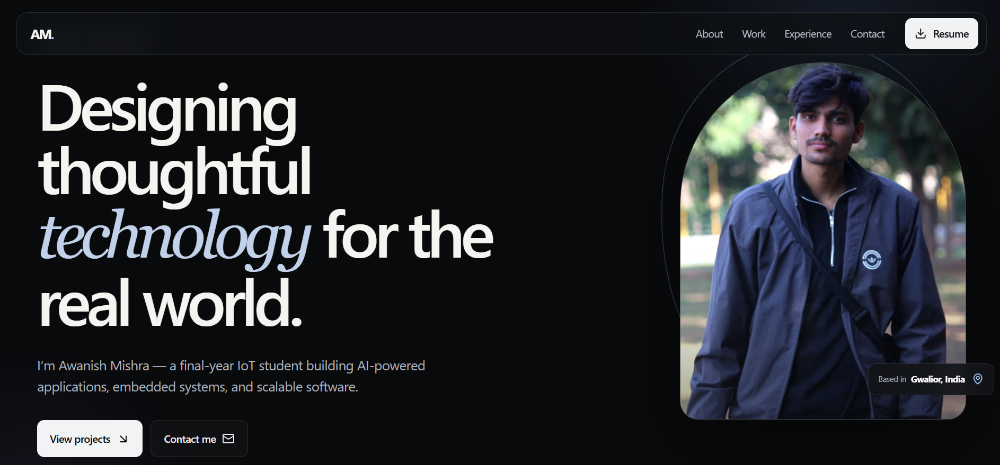
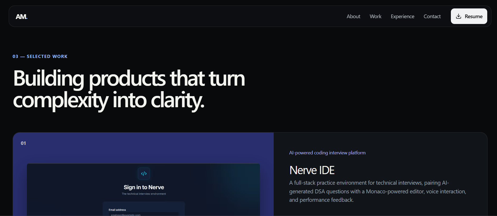

<div align="center">

# 👋 Hi, I'm Awanish Mishra

### Final Year IoT Engineer • AI Enthusiast • Full Stack Developer

Building intelligent software, embedded systems, and AI-powered applications that solve real-world problems.

🌐 **Live Portfolio:** https://portfolio-awanish.vercel.app/

</div>

---

# 🚀 About The Project

This repository contains my personal developer portfolio built using **Next.js 15**, **TypeScript**, and **Tailwind CSS**.

The website highlights my journey, technical skills, featured projects, certifications, resume, and contact information in a clean and modern interface.

---

# ✨ Features

- ⚡ Lightning Fast (Next.js 15)
- 📱 Fully Responsive
- 🎨 Modern Dark UI
- 🚀 Smooth Animations
- 💼 Project Showcase
- 📄 Resume Download
- 🏆 Certifications
- 📬 Contact Section
- 🔍 SEO Friendly

---

# 📸 Preview

## Hero Section



---

## Featured Projects



---

# 🛠 Tech Stack

### Frontend

- Next.js
- React
- TypeScript
- Tailwind CSS

### Libraries

- Framer Motion
- Lucide React
- React Icons

### Deployment

- Vercel
- GitHub

---

# 📂 Project Structure

```
app/
public/
│
├── documents/
├── images/
│   ├── hero.png
│   ├── project.png
│   ├── about-awanish.jpg
│   ├── hero-awanish.jpeg
│   ├── certificates/
│   └── projects/
```

---

# 🚀 Getting Started

Clone the repository

```bash
git clone https://github.com/awanishmishra642-commits/portfolio-awanish.git
```

Move into project

```bash
cd portfolio-awanish
```

Install dependencies

```bash
pnpm install
```

Run locally

```bash
pnpm dev
```

Open

```
http://localhost:3000
```

---

# 🌍 Live Demo

### 🔗 https://portfolio-awanish.vercel.app/

---

# 📌 Future Improvements

- Blog Section
- Project Filtering
- Light Theme
- Multi-language Support
- Analytics Dashboard
- Interactive Resume

---

# 🤝 Connect With Me

- 💼 LinkedIn
- 🌐 Portfolio
- 💻 GitHub

---

<div align="center">

### ⭐ If you like this project, consider giving it a Star!

Made with ❤️ by **Awanish Mishra**

</div>
